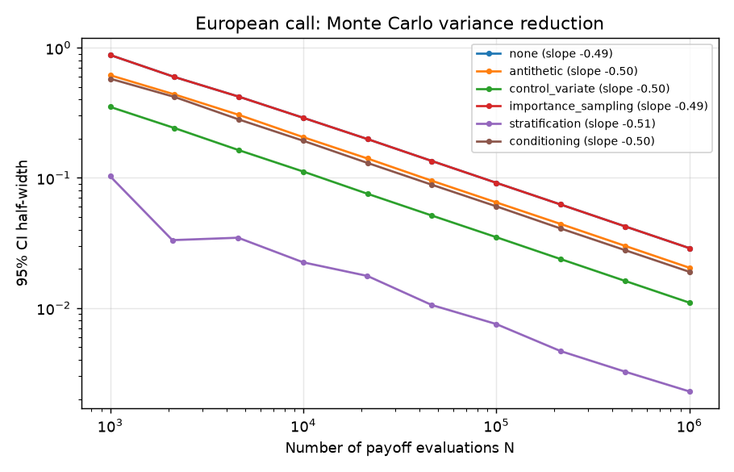
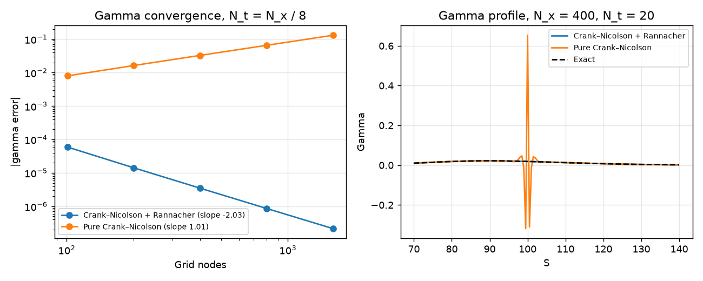
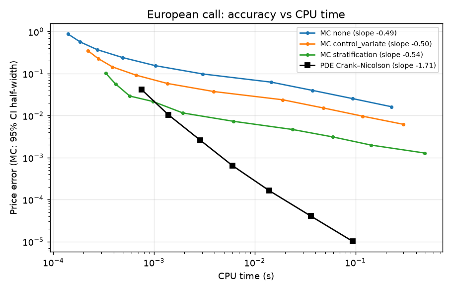
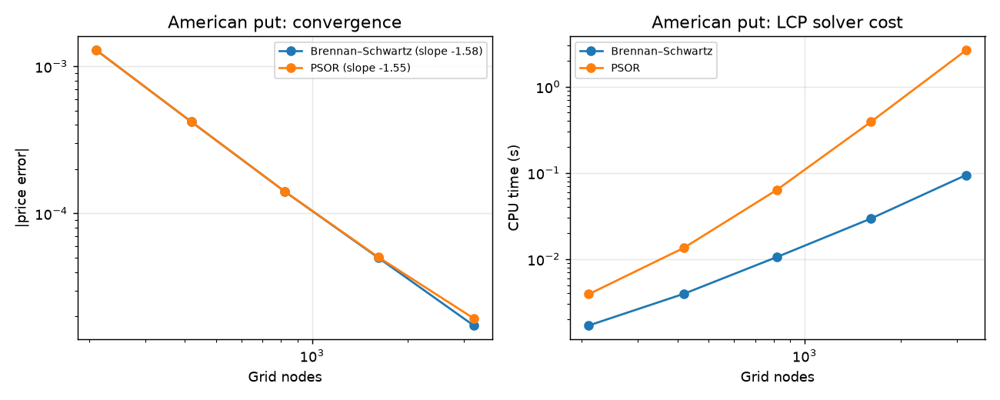
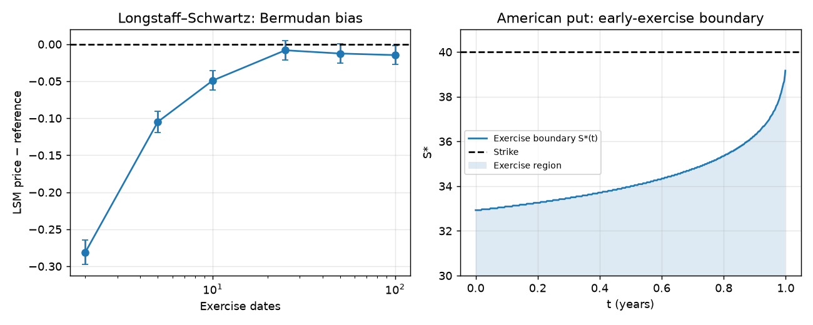

# Cross-validated option pricer: finite differences vs Monte Carlo

Two independent pricing engines for European and American options under Black–Scholes. Each is validated against closed forms or literature benchmarks, and against the other:

- **Finite differences:** a θ-scheme / Crank–Nicolson solver on the log-spot PDE, with Rannacher start-up and pinned-node grids. For American exercise, the linear complementarity problem is solved with **PSOR** and **Brennan–Schwartz**.
- **Monte Carlo:** exact simulation with five variance-reduction techniques (control variate, importance sampling, antithetic variables, stratification, pre-conditioning). Greeks use pathwise and likelihood-ratio estimators. American options are priced with **Longstaff–Schwartz** regression.

Convergence studies measure the empirical order of each method and its accuracy per unit of CPU time. A Streamlit dashboard runs everything interactively.

## Key results

| | Result |
|---|---|
| Monte Carlo convergence | CI half-width ∝ N^−0.50 for every technique: variance reduction moves the line down, it does not change the slope |
| Best variance reduction (ATM call) | **Stratification: variance ÷159**, efficiency ≈ ×100 at equal CPU time. Control variate ÷6.9, antithetics ÷2.0 |
| Crank–Nicolson order | Price, delta and gamma errors ∝ N^−2.0 with Rannacher start-up |
| Rannacher start-up | With N_t = N_x/8, the pure-CN gamma error **grows** with refinement (slope +1.0). Rannacher restores slope −2.0 |
| MC vs PDE (European, 1D) | For an error of 10⁻³, the PDE is ~100× faster than the best Monte Carlo |
| American put (K = 40, S₀ = 36) | Reference 4.48667. PDE and an independent BBSR binomial tree agree to 10⁻⁵. The value in Longstaff–Schwartz (2001, Table 1), 4.478, comes from a coarse grid |
| LCP solvers | PSOR and Brennan–Schwartz give the same solution (10⁻⁶). At 3 200 nodes, Brennan–Schwartz is **~25× faster** (0.1 s vs 2.6 s) |
| Longstaff–Schwartz | Downward Bermudan bias: −0.28 with 2 exercise dates, −0.01 with 50 |

## Figures

**Monte Carlo variance reduction.** All techniques converge in N^−1/2. Stratification of the Gaussian driver dominates in this one-dimensional problem. Importance sampling does nothing at the money, since the optimal drift is 0, so its line overlaps the crude estimator.



**Why Rannacher start-up.** The payoff kink excites high-frequency modes that Crank–Nicolson does not damp when Δt is large compared with Δx². The gamma oscillates around the strike and stops converging. Two implicit Euler half-steps at the start remove the oscillations.



**Accuracy per unit of CPU time.** In one dimension the PDE wins by orders of magnitude: its error decreases like (CPU time)^−1 in theory, versus (CPU time)^−1/2 for Monte Carlo. The measured PDE slope is steeper than −1 because fixed overheads dominate on small grids. Monte Carlo becomes competitive only in higher dimensions.



**American put: LCP solvers.** Same accuracy, but the iterative PSOR needs more and more sweeps as the grid is refined, whereas Brennan–Schwartz is a direct O(N) method. The measured order (~1.6) is below 2 because the price is only C¹ across the free boundary.



**American put: Longstaff–Schwartz and the exercise boundary.** With few exercise dates the option is Bermudan, worth less than the American. The regressed exercise rule adds a small downward bias, so the estimator is a lower bound. The early-exercise boundary is computed by the PDE solver.



## Methods

**Monte Carlo** (`pricing/mc/`)
- Exact simulation of S_T, or of whole paths, under the risk-neutral measure, with a continuous dividend yield.
- Variance reduction, one technique at a time, with a fair budget of N payoff evaluations:
  - control variate on e^{−rT}S_T, with the regression coefficient β estimated on the same sample;
  - importance sampling, a Gaussian shift centred on the strike (μ = −d₂);
  - antithetic variables, with the standard error computed on pair means;
  - proportional stratification of N(0,1) into equiprobable strata;
  - pre-conditioning: the Black–Scholes conditional price given S_{θT}.
- Greeks: pathwise (tangent process) and likelihood-ratio delta, and likelihood-ratio and mixed gamma. Pathwise gamma is rejected, since the second derivative of the payoff is a Dirac mass.
- American options: Longstaff–Schwartz with a polynomial basis. The regression is fitted on training paths and the price is estimated on independent paths (a lower-bound estimator with a valid CI). Delta is computed pathwise, with the exercise rule held fixed.

**Finite differences** (`pricing/pde/`)
- PDE in x = ln S with constant coefficients, and a uniform grid where both S₀ and K are nodes. When K is too close to S₀ to be pinned, the payoff is averaged over each cell instead.
- θ-scheme (Crank–Nicolson by default) with Rannacher start-up. A tridiagonal solve per step, O(N).
- American options: at every step, a linear complementarity problem solved by projected SOR or by the Brennan–Schwartz algorithm (projected Thomas, starting from the exercise region). Both loops are compiled with Numba, so that timings measure the algorithms rather than the interpreter.
- Greeks are read off the grid. The early-exercise boundary is recorded at each step.

**Validation** (`tests/`, 125 tests)
- Closed forms: Hull textbook values, put–call parity, Greeks against finite differences of the price.
- Monte Carlo: unbiasedness within 4σ̂ for every technique and Greek, variance reduction actually achieved, N^−1/2 slope, reproducibility.
- PDE: accuracy against closed forms, measured order 2, Rannacher necessity, cell averaging.
- American options:
  - literature benchmarks;
  - PSOR = Brennan–Schwartz;
  - complementarity conditions;
  - American ≥ European ≥ intrinsic;
  - American call without dividends = European call;
  - monotone exercise boundary;
  - Longstaff–Schwartz lower bound and Bermudan bias.
- Dashboard smoke tests (Streamlit `AppTest`).

## Quick start

```bash
python -m venv .venv
.venv/Scripts/python -m pip install -e ".[dev]"     # Linux/macOS: .venv/bin/python
.venv/Scripts/python -m pytest
.venv/Scripts/python -m streamlit run app/dashboard.py
.venv/Scripts/python scripts/make_figures.py       # regenerates the figures above
```

```python
from pricing import (AmericanOption, BlackScholes, EuropeanOption, MCConfig, PDEConfig,
                     price_mc, price_pde, reference_price)

model = BlackScholes(s0=100, r=0.05, sigma=0.2)

call = EuropeanOption(strike=100, maturity=1.0, kind="call")
print(model.closed_form(call).price)                                              # 10.4506
print(price_mc(model, call, MCConfig(variance_reduction="stratification")).price)
print(price_pde(model, call, PDEConfig(n_space=400, n_time=50)).price)

put = AmericanOption(strike=100, maturity=1.0, kind="put")
print(price_pde(model, put, PDEConfig(lcp_solver="brennan_schwartz")).price)
print(price_mc(model, put, MCConfig(n_paths=100_000, n_steps=50)).price)          # Longstaff–Schwartz
print(reference_price(model, put).price)
```

## Layout

| Path | Content |
|---|---|
| `pricing/models/` | Black–Scholes dynamics, exact simulation, closed forms |
| `pricing/products/` | European and American vanilla options |
| `pricing/mc/` | Monte Carlo engine, variance reduction, Greeks, Longstaff–Schwartz |
| `pricing/pde/` | Grid, θ-scheme, LCP solvers (PSOR, Brennan–Schwartz), American solver |
| `pricing/reference.py` | Reference prices (closed form or very fine PDE) |
| `pricing/convergence.py` | Refinement studies and slope fits |
| `app/dashboard.py` | Streamlit dashboard |
| `scripts/make_figures.py` | Figures and results table of this README |
| `docs/specs/` | Design documents |

## Roadmap

1. European options ✅
2. American options ✅
3. Barrier options (pinned barriers, Brownian-bridge correction) and digital options
4. Local volatility and Heston (Euler/Milstein schemes, multilevel Monte Carlo)

## References

- G. Pagès, *Numerical Probability: An Introduction with Applications to Finance*, Springer, 2018.
- P. Glasserman, *Monte Carlo Methods in Financial Engineering*, Springer, 2003.
- F. Longstaff, E. Schwartz, *Valuing American options by simulation: a simple least-squares approach*, RFS, 2001.
- M. Brennan, E. Schwartz, *The valuation of American put options*, Journal of Finance, 1977.
- R. Rannacher, *Finite element solution of diffusion problems with irregular data*, Numerische Mathematik, 1984.
- D. Pooley, K. Vetzal, P. Forsyth, *Convergence remedies for non-smooth payoffs in option pricing*, J. Comp. Finance, 2003.
- M. Broadie, J. Detemple, *American option valuation: new bounds, approximations, and a comparison of existing methods*, RFS, 1996.

## How this was built

I built this project with the help of **Claude** (Anthropic's AI assistant), which contributed to the design discussions, implementation, test design and numerical validation. I defined the scope and the comparisons, and made the method choices. It was developed alongside my MSc in Probability and Finance (Sorbonne Université / École Polytechnique).

— Alexandre Saad El Din-Gâche
